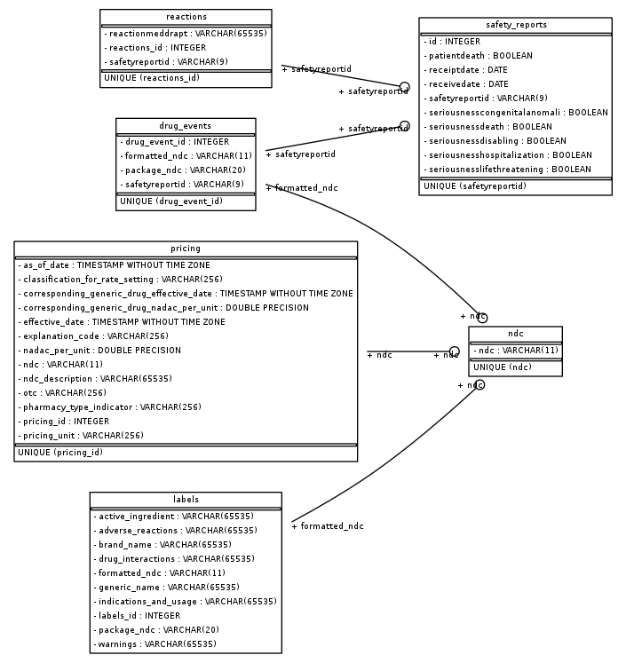
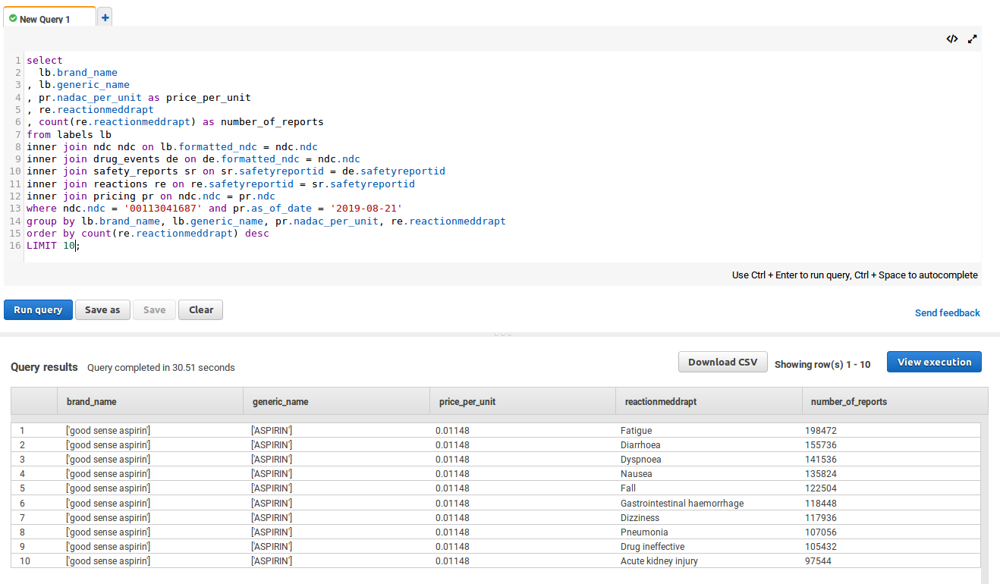

# Data Engineering NanoDegree Capstone Project:
# Drug Information Data Warehouse in the Cloud

## Overview

This project created a drug information database with over **one billion rows** by combining drug label information, pricing and adverse events data for drugs registered in the National Drug Code (NDC) Directory of the United States. The database was designed for use as the back end of a medication research tool for consumers and professionals. The database's data model was optimized for deployment on a multi-node cluster from Amazon's Redshift database service. An ETL process scripted in python automatically downloads the data from each source into Amazon S3 buckets for staging; transforms and normalizes the data; and loads the data into the database.

## Data Sources

* [National average drug acquisition cost](https://dev.socrata.com/foundry/data.medicaid.gov/tau9-gfwr) (nadac) pharmacy pricing was sourced from the Centers for Medicare & Medicaid Services (CMS) through the Socrata Open Data API. **The data is downloaded in the form of a list of dicts** using the sodapy python client.
* Drug labels and adverse event data were downloaded from the [openFDA S3 bucket](https://open.fda.gov/apis/downloads/) of the U.S. Food and Drug Administration (FDA) at open.fda.gov. The data is available as **zipped JSON files** partitioned by date.
* The Federal Adverse Event Reporting System (FAERS) is the original source of the adverse events data. FAERS provides quarterly data going back to Q1 2004. For purposes of practicality and cost, only reports from Q1 2018 through Q1 2019 were loaded into the database. Even with this limited timeframe, the reports generated more than one billion drug/report combinations.

## Data model

The data model contains six tables from three disparate sources linked by two primary join fields.

`drug_events`, `pricing` and `labels` are joined together by the NDC codes of the drugs.

`safety_reports`, `drug_events` and `reactions` and linked together by _safetyreportid_.

### Distribution and sortkeys

Unlike traditional RDBMS, Redshift distributes the tables among multiple nodes and uses columnar storage. This means that traditional indexing is not available. Instead, performance is tuned using parameters that define how the tables are distributed among the nodes and how the data is sorted and summarized over the stored columns.

`ndc`, the consolidated list of NDC codes, is the smallest table in the database with 321k rows. Its use is anticipated for table joining in almost all queries. In order to improve query response times, `ndc` is distributed to all the nodes in the cluster using DISTSTYLE 'ALL'.

The largest table in the database, `drug_events`, has more than one billion rows. `drug_events` is distributed by _safetyreportid_ to facilitate joins to `safety_reports` and `reactions`, and sorted on *formatted_ndc* to facilitate joins to `pricing` and `labels` via the `ndc` table.

## Results

Test queries confirmed the ability to retrieve drug information, pricing and adverse events data.

## Data Quality Checks

Quality checks were incorporated into the ETL process.

* The script tests for missing NDC codes in the adverse events data and excludes those records from the database, since they cannot be linked to prices or labels.
* Similarly, the code tests for and excludes missing drug reactions.
* Duplicate records are eliminated from the safety_reports data prior to loading into the database, as Redshift does not enforce uniqueness and other constraints.

## Steps Taken in Project

1. Selected drug data as project topic and confirmed availability of public data.
* Developed use case.
* Researched data formats, download options and API instructions.
* Downloaded and explored sample data from each dataset .
* Identified potential join fields among the three datasets.
  * Located instructions to convert 10-digit NDC codes from labels and drug events to 11-digit NDC codes used in pricing data.
* Developed and tested extraction processes.
  * Located a community AWS Lambda function to automatically unzip JSON archives (serverlessrepo-s3-uncompressor-UncompressFunction-1UT7EMTAJOBXH).
  * Created S3 buckets as staging locations for unzipped and transformed data.
* Developed and tested transform processes.
  * Utilized pandas to normalize nested JSON structure of adverse events data.
  * Configured an EC2 instance to run ETL since local machine was overloaded.
* Downloaded data from openFDA S3 bucket over more than 3 days.
* Finalized data model and created Redshift database.
* Ran ETL script from EC2 instance to populate database.
  * Repeated steps 4-10 many times, and in multiple orders, until the data actually loaded.
  * Redesigned distribution and sortkey config until test queries loaded in reasonable timespans.
* Ran test queries to verify database performance

## Other Scenarios

**If the database size was increased by 100X**, it would be difficult to maintain query performance when joining the pricing, labels and drug_events tables via NDC code. In this case it would be worth considering moving to a NoSQL database structure such as Cassandra, with each table consolidating the pricing, adverse events and label information for a single drug. This would facilitate the main use case of the database to research individual medications. However, it would reduce the ability of the database to support aggregate trend analysis of adverse reactions over, say, brand-name vs generic drugs or drug types over time.

**To update the database every morning at 7am**, it would make sense to utilize a pipeline scheduling application such as Airflow. The downloading tasks could be implemented using Airflow hooks to AWS S3 buckets, and the uploading could utilize existing hooks to Redshift. Transform tasks could be implemented using python callables with fairly limited modifications to the existing ETL script. Or, custom operators could be developed to support code reuse.

**If the database needed to be accessed by 100+ people,** one could enable concurrency scaling in Redshift. In this case Redshift adds clusters as needed to support increases in demand for concurrent querying of the database. There are a number of [technical requirements for concurrency scaling](https://docs.aws.amazon.com/redshift/latest/dg/concurrency-scaling.html) such as node type, sort key type (cannot use interleaved sorting) and query type (e.g. read-only) that must be met. The existing data model and cluster configuration would need to be reviewed to meet these requirements.
